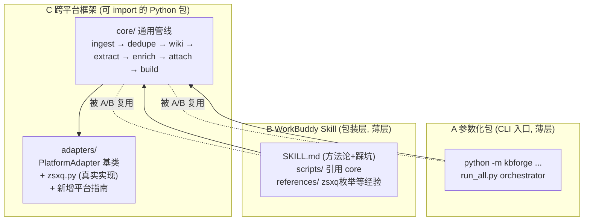

# 知识星球整理工具集 · 开源化方案（v1 · 已落地）

> **文档状态**：本文是方案确认稿（设计已 100% 落地）。结论来自 2026-07-12（架构选型、坑清单、wiki 整合、竞品定位）与 2026-07-13（入站增量/断点续传、enrich 边界、config 拆分、灵活性扩展点、OKF 契约采纳、§11 七项宏观决策逐条拍板）多轮讨论。**接口/配置类设计（§4.5 / §5.6 / §6.2 / §9.2 / §5.7 / §7.6）已确认并写入**；**§11 全部 8 项宏观决策点已拍板**（第 8 项 OKF 契约 + 第 1–7 项：一核心两薄封装 / 抽象接口+zsxq实现+扩展文档 / 专家包一并做 / enrich 留接口可mock / 项目名 kb-forge / fbs-bookwriter 四层质检 / 新建独立目录）。**方案已锁，且已全部落地实施**（kb-forge 已从 Phase 0 一路做到「真实 archive 接入」，53 个测试全绿，已提交并推送到 GitHub）。宏观决策（§11 共 8 项）+ P2 增补（§12 共 5 项）均已于 2026-07-13 议定，文中无遗留待决项。
>
> **实施目标目录**（新建，不污染当前知识库）：项目 `kb-forge` 置于本地知识库目录下（项目名 `kb-forge`，见 §9.1 / §11-5）。

---

## 目录

1. [项目定位与差异化（竞品调研）](#1-项目定位与差异化竞品调研)
2. [整体架构：一核心 + 两薄封装](#2-整体架构一核心--两薄封装)
3. [GitHub 开源项目结构](#3-github-开源项目结构)
4. [模块设计总览](#4-模块设计总览)
5. [wiki 模块设计（核心，吸收 obsidian-llm-wiki）](#5-wiki-模块设计核心吸收-obsidian-llm-wiki)
6. [开源前必避的坑与护栏](#6-开源前必避的坑与护栏)
7. [测试与验证策略](#7-测试与验证策略)
8. [文档规划（5 类 + 配图）](#8-文档规划5-类--配图)
9. [命名与许可](#9-命名与许可)
10. [分阶段交付计划](#10-分阶段交付计划)
11. [待拍板决策点汇总](#11-待拍板决策点汇总)
12. [P2 增补项决策](#12-p2-增补项决策)

---

## 1. 项目定位与差异化（竞品调研）

### 1.1 同类项目全景

| 类别 | 代表项目 | 亮点 | 局限（= 我们的空间） |
|---|---|---|---|
| **A 类：知识星球专用抓取** | `ZsxqCrawler`(davideuler)、`zsxq-exporter`(yiancode)、zsxq-spider / zsxq_playwright | 全量/增量采集、文件下载、Web UI/CLI、部分带 AI 分析 | 纯"下载器"，**不整理、不编译 wiki、不出案例/PPT**；硬编码 zsxq，无平台抽象 |
| **B 类：LLM Wiki 自动化** | `obsidian-llm-wiki`(green-dalii, Apache-2.0)、`llm-wiki-skill`(sdyckjq-lab, 1183⭐)、nashsu/llm_wiki、axiom-wiki 等 | 实体/概念双页、矛盾检测、来源落地、lint、对话查询 | 只做 wiki 编译/查询，输入是"已扔进 raw/ 的文档"，**不负责从平台抓取、不处理附件、不产出 PPT** |
| **C 类：社媒 → 知识库** | `rednote-rag`（小红书→RAG）、Social-Media-RAG、Second Brain / Mnemo | 社媒帖→结构化/向量/RAG，OCR+来源回溯+增量 | 偏检索型、绑定单一平台、无 wiki 编译、无 PPT 产出 |
| **D 类：知识格式标准** | `OKF`(Google Cloud, Apache-2.0, v0.1) | 把 Karpathy LLM Wiki 官方化为厂商中立的 Markdown+YAML 知识包规范；概念=文件、链接=图谱、`type` 必填 | 只是格式契约，不含抓取/enrich/exporters/MCP；v0.1 早期会演进——**它是我们 wiki 产物的目标契约，不是竞品** |

### 1.2 关键空白

把上面拼起来，**没有任何项目同时具备**：

1. 从**知识星球**（或泛指付费社媒）**抓取** →
2. **Raw/Wiki/Schema 三层编译**（Karpathy 范式） →
3. **附件 B 方案**（平行镜像 + 双链回写，我们踩过的独特坑） →
4. **案例/踩坑萃取** →
5. **出 PPT** →
6. 且**跨平台可扩展**（adapter 抽象）、**可开源复用**（A/B/C 三层 + 合成数据合规）。

每个单点都有竞品，但"端到端 + 跨平台 + 开源"这条线**是空白**——这就是本项目的定位价值。

### 1.3 我们的差异化策略

- **抓取层（A 类）不重复造**：zsxq 部分参考 `ZsxqCrawler` 的增量/Cookie 逻辑，或对齐我们现有的 `zsxq-cli` adapter；精力放在它没做的 2–5。
- **wiki 模块（B 类）站在巨人肩上**：以 `obsidian-llm-wiki` 的真实开源实现（矛盾检测/来源落地/lint 架构）为主要参考，少走弯路（详见 §5）。
- **整体主打**：「平台抓取 → 知识工程 → 多下游产出（含 PPT）的全链路 + 跨平台开源框架」，避开和纯 wiki 工具、纯下载器的正面竞争。
- **合规护城河**：合成 `examples/` + 凭证外置 + SECURITY.md 声明，做干净的开源，反成信任优势。
- **OKF 兼容背书**：wiki/cases/pitfalls 产物对齐 **OKF v0.1** 开放规范（Google 官方化的 LLM Wiki 格式），天然可接入 Knowledge Catalog 等生态，并把上轮「图谱中间态 / 血缘 / 合规 golden test」吸收为标准锚点，无需自创。

---

## 2. 整体架构：一核心 + 两薄封装

### 2.1 为什么不做「三套并行代码」

原方案中 A（参数化脚本）与 C（可 import 框架）本质是同一批逻辑的两种成熟度。写成两份 = 同一个 bug 修两次、同一条匹配规则同步两处，开源后维护会拖垮项目。

**结论：core 唯一真相源，A/B/C 共享一份逻辑；对外仍是三种独立形态，但改一处三处生效。**

### 2.2 三层关系



- **core**：装所有真逻辑（match / writeback / wiki / dedupe / pptx / adapter）。即用户诉求里的「C 跨平台框架」，但不额外造第二份代码。
- **A** = core 的 CLI/脚本入口（`python -m kbforge` 或 `run_all.py`），薄薄一层，几乎无独立逻辑。
- **B** = core 的 Skill 封装，`SKILL.md` + `scripts/` 直接调 core。
- 用户的「A/B/C 都要、都可测」**一条不丢**：用户仍能拿到独立命令行、独立技能、独立框架，只是底下共享一份代码。

---

## 3. GitHub 开源项目结构

```
kb-forge/                        ← 新建独立目录
├── README.md                     # 总入口：A/B/C 导航 + 快速开始（中英双语）
├── LICENSE                       # Apache-2.0
├── NOTICE                        # 第三方贡献者（若借鉴 obsidian-llm-wiki 思路，注明方法论来源）
├── SECURITY.md                   # 合规声明：仅供个人备份、遵守平台 ToS、不存储凭证
├── CONTRIBUTING.md
├── CODE_OF_CONDUCT.md
├── CHANGELOG.md
├── .gitignore                    # 忽略 .env / _attachments / 真实数据
├── pyproject.toml                # 根：统一依赖 + pytest + 工具
├── src/kbforge/                  # ── 唯一真相源 core ──
│   ├── core/                     #   通用管线模块
│   │   ├── ingest.py             #   抓取后的原始归档整理
│   │   ├── dedupe.py             #   去重
│   │   ├── wiki/                 #   ★ wiki 子包（见 §5）
│   │   ├── extract.py            #   案例/踩坑萃取 → 结构化 CaseBundle
│   │   ├── attach.py             #   附件匹配+回写+归位
│   │   └── exporters/            #   ★ 可插拔产出层（见 §4.4）
│   │       ├── base.py           #   BaseExporter 抽象基类
│   │       ├── pptx.py           #   标杆案例合集.pptx
│   │       ├── markdown.py       #   Markdown 精编/周报
│   │       └── html.py           #   可分享 HTML 案例展示页
│   ├── adapters/                #   平台适配层
│   │   ├── base.py               #   PlatformAdapter 抽象基类
│   │   ├── zsxq.py               #   知识星球真实实现（封装 zsxq-cli）
│   │   └── example_wechat.py     #   仅作「如何新增平台」示例骨架（带明确 TODO）
│   ├── cli.py                    #   kbforge pull / organize / build / wiki ...
│   └── config.py                 #   读 config.yaml + .env
├── config.example.yaml          #   配置样例（绝不提交真实值）
├── docs/                         # ── 5 类文档 + 配图 ──
│   ├── design/  technical/  testing/  guide/  operations/
│   └── (各含 assets/ 放配图)
├── tests/                        #   跨包测试
│   ├── fixtures/                 #   合成示例知识库（确定性生成）
│   └── unit/  integration/  e2e/
├── examples/                     #   由 fixtures 生成的演示小库（合成数据）
├── .kbforge/                     #   运行时状态（gitignore）：state/<group_id>.json 抓取游标/幂等集
├── config.default.yaml           #   默认 profile（被 --profile 覆盖）
├── .github/workflows/           #   CI：pytest + B 的 skill 打包校验
└── B-workbuddy-skill/            #   B 类：WorkBuddy Skill 包装（引用 src/kbforge）
    ├── SKILL.md
    ├── scripts/                  #   薄壳，转调 core
    ├── references/               #   方法论 + 踩坑（zsxq 枚举等）
    └── assets/
```

> **A 类**以 `src/kbforge` 的 CLI 入口体现；**C 类**以 `src/kbforge`（可 import 包）+ `adapters/` 体现；**B 类**以 `B-workbuddy-skill/` 体现；**专家包（第四类，2026-07-13 确认一并做）**以 `expert/` 目录体现，是核心之上的又一个薄封装，复用 core 的 `run_all` orchestrator 与 references，与 B 同构但面向 WorkBuddy 专家体系交互壳。四类目录分离、代码共享（均不脱离「一核心」原则）。**B 与专家包在安装说明/requirements 中声明 `kbforge>=0.1.0` 兼容区间（不精确钉死），避免 core 版本漂移致薄封装静默崩（详见 §7.4 / §12-⑤）。**

---

## 4. 模块设计总览

### 4.1 core 包职责

| 模块 | 职责 | 来源/备注 |
|---|---|---|
| `ingest.py` | 抓取后原始归档整理（frontmatter、目录分年/月） | 重构现有 `process_inbox`/`archive_dedupe` |
| `dedupe.py` | 跨源去重 | 现有 `archive_dedupe` |
| `wiki/*` | Wiki 编译（机械层+增强层+索引+lint+查询） | **重点，见 §5** |
| `extract.py` | 案例/踩坑萃取 → 结构化 `CaseBundle`（再分发到 exporters） | 现有 `extract_cases`/`extract_pitfalls` |
| `attach.py` | 附件匹配（No 编号+标题匹配）、回写、归位 | 现有 `match_attachments`/`writeback`/`place_remaining` |
| `exporters/*` | 可插拔产出层：pptx / markdown / html（见 §4.4） | 替代现有 `build_pptx`（**当前仅 0.05MB 空壳，需打通**）|
| `cli.py` | 统一命令入口 + `run_all` orchestrator + `--profile`/`--stage`/`--dry-run` | 新增 |

### 4.2 平台适配层（C 跨平台落地）

- **抽象基类 `adapters/base.py`**：定义 `fetch_topics()` / `download_attachment()` / `paginate()` 等必须实现的方法签名 + 返回类型（与下游管线解耦）。
- **真实实现 `adapters/zsxq.py`**：封装本机 `zsxq-cli`，CLI 路径可配置（不再硬编码本机二进制）；分页 cursor 持久化（支持断点续传/增量）。
- **扩展指南 `docs/guide.md#新增平台` + `example_wechat.py`**：给一个带 `TODO` 的示例骨架，**不写无法测试的死代码**。接口清晰 + 一个能跑的实现 + 扩展文档，比三个空壳更专业。

### 4.3 附件链路（B 方案 Parallel mirror）

保留已验证的设计：附件存 `_attachments/<group_id>/<YYYY>/<MM>/t<topic_id>/`，镜像 archive 结构；归档帖内「## 附件」段用相对路径 `../../../_attachments/...` 回写。匹配优先级：① 文件名 `No.XX` 编号 → archive 标题；② 标题子串映射（`TITLE_SUBSTR`，首次运行出探针报告 → 人工确认后写映射文件，不再硬编码）；③ 无编号且 archive 搜不到 → **zsxq 全量枚举附件名**（search 只搜正文不搜附件名，必须枚举）。

### 4.4 案例萃取与「可插拔产出」（关键设计）

> **设计原则**：萃取与渲染解耦。`extract.py` 只产出**结构化中间表示 `CaseBundle`**（cases[] / pitfalls[] / metadata / sections），不关心最终格式；渲染交给各自独立的 exporter。这是用户明确要求的「产出可开关、可换格式」能力，也是 C 类跨平台框架「两端开放」哲学（输入侧平台可换、输出侧格式可换）的体现。

- **萃取**：`extract.py` 从归档萃取案例/踩坑 → 生成 `CaseBundle`（dataclass）。当前 `cases/`(50+) `pitfalls/`(7+) 是落盘形式，重构后先入内存结构再分发。
- **可插拔产出层 `exporters/`**：
  - `base.py`：`BaseExporter` 抽象基类，定义 `export(bundle, out_path) -> Path` 与 `name`/`suffix` 等元数据。
  - 内置三实现（按用户确认）：`pptx.py`（标杆案例合集.pptx，核心收口产出，当前 `build_pptx.py` 空壳需打通）、`markdown.py`（Markdown 精编/周报）、`html.py`（可分享 HTML 案例展示页）。
  - 新增格式 = 写一个 exporter 文件 + 注册进 `EXPORTERS` 字典，**零改动其他代码**。
- **开关与多格式**（config.yaml + CLI 均可）：
  ```yaml
  output:
    enabled: true
    formats: [pptx, md]        # 想要啥列啥，可多选
  ```
  ```bash
  kbforge build --output pptx,html     # CLI 临时覆盖
  kbforge build --no-output            # 只整理不产出（"有时只想整理"场景）
  ```
- `run_all` orchestrator 读 `output` 段决定末段跑几个 exporter。

### 4.5 灵活性与扩展点设计（已确认）

> 以下 4 点是 2026-07-13 设计讨论确认、Phase 0 地基要先锁死的接口契约。

- **多星球 / 多 profile**：`kbforge --profile <name>` 切换不同 `config.<name>.yaml`，而非写死单一库。开销极小、对开源用户价值大。
- **单 stage 选择性重跑 + 全 stage 标准 `--dry-run`**：`kbforge run --stage wiki --topic <tid>` 只重编某帖；每个会改文件的 stage 都支持 `--dry-run`（attach 已实践，推广为规范）。全量重跑太贵，必须能精准打点。
- **矛盾策略可配**：`wiki.conflict_policy: record`（默认，写 `.conflicts.md` 不阻塞，适合 CI/无人值守）/ `fail`（严格模式，遇矛盾即停，适合人工精编）。
- **SCHEMA 主题运行时动态解析**：`schema.py` 每次跑**读 SCHEMA.md 抽主题清单**，而非硬编码主题进代码。用户加新主题不用改代码、不用重编译。

---

## 5. wiki 模块设计（核心，吸收 obsidian-llm-wiki + 对齐 OKF）

### 5.1 参考源变更说明

原方案参考 `wiki-creator` 的 SKILL.md（仅方法论概览）。经深挖，改以 **`obsidian-llm-wiki`（green-dalii，Apache-2.0，TypeScript Obsidian 插件）的开源实现为主要参考**——它把同一套 Karpathy 范式工程化到了生产级，且 bug 检测/lint/来源落地都有真实代码可借鉴。

> **合规红线**：obsidian-llm-wiki 是 Obsidian 插件（TS），我们是 Python CLI 管线，代码不可直接搬。**仅借鉴其算法/架构/护栏红线，独立用 Python 重写实现**，并在 `NOTICE` 注明方法论来源。不复制其源码。

> **格式契约层新增 OKF**（2026-07-13 决策）：wiki/cases/pitfalls 的**产物形态**对齐 Google **Open Knowledge Format (OKF) v0.1**（Apache-2.0）——它把 Karpathy LLM Wiki 官方化为厂商中立规范，正好定义「我们 wiki 层对外长什么样」。obsidian-llm-wiki 负责**怎么编译/lint**（算法），OKF 负责**编译出来是什么格式**（契约），二者互补、不冲突。详见 §5.7。

### 5.2 obsidian-llm-wiki 实现剖析（可借鉴机制）

| 机制 | 实现位置（obsidian-llm-wiki） | 我们借鉴为 |
|---|---|---|
| **迭代批提取** | `source-analyzer.ts` + `core/batch-limits.ts`（粒度配置 fine~minimal）、`core/convergence-detector.ts`（yield 低于 50% 减半直至收敛停）、`core/batch-merger.ts`（去重+自定义上限） | `enrich.py` 的 LLM 增强算法骨架：长文档分批、收敛即停、避免死抠不存在的实体 |
| **引用锚定（quote-grounding）** | `Mentions in Source` 区块保留原文引用；frontmatter `sources: [...]`；复合去重键 `(quote, source_path)`；非丢失重摄入（并集累积 mentions） | `ingest.py`/`enrich.py`：每条事实标来源文件+章节；重摄入用并集而非覆盖 |
| **矛盾状态机** | `detected → review-passed → resolved` / `detected → unresolved`；矛盾保留并附来源 | `diff.py`：新资料与旧页冲突 → 写 `.conflicts.md` 标记，不静默覆盖 |
| **实体/概念双页** | frontmatter `type: concept\|entity` + `aliases/tags/created/updated/sources` | `ingest.py` 页模板：与现有 concepts/entities 分面一致，补规范字段 |
| **分层 lint** | `lint-controller.ts`：重复页/死链/空页/孤儿/缺失别名/矛盾；Tier-1 直接名称+Tier-2 间接信号（共享链接/中相似） | `lint.py` 升级：语义重复分级检测、Smart Fix 因果顺序 |
| **Personalized PageRank 查询** | 在 `[[wiki-link]]` 图谱上做 PPR，零 embedding 成本 | `query.py`（可选）：服务 RAG 召回，替代纯向量 |
| **预处理门控** | 摄入前验证空文件/frontmatter-only/内容哈希去重 | `ingest.py` 前置校验 |

### 5.3 我们 `core/wiki/` 的落点映射

```
src/kbforge/core/wiki/
├── schema.py       # 解析 SCHEMA.md 主题清单, 校验 topic 命中 (对齐"不擅自改SCHEMA")
├── ingest.py       # 确定性机械层: 归簇+实体+指针+规范页模板 (重构自 wiki_ingest); 写入 content_hash 副字段
├── enrich.py       # LLM 增强层: 对齐 page 模板生成初稿, 标[待增强], 不臆造 (吸收迭代批提取算法)
├── diff.py         # 受控三步 + 限流: conflict→.conflicts.md (新增, 吸收矛盾状态机)
├── build_index.py  # index.md + topics/*.md + 三 JSON (.manifest/.graph/.backlinks)
├── lint.py         # 升级: 孤立/悬空/无来源/矛盾/主题孤儿 + 分层语义重复 (重构自 wiki_lint)
└── query.py        # Retriever 接口 + 默认 PPR 图检索 (零依赖), embedding 后端可选 OFF (见 §5.3.2)
```

#### 5.3.1 内容寻址（副字段，2026-07-13 议定）

- **不做主 ID 改写**：档案文件名 `*-t<topic_id>.md` 与附件链（No.XX / TITLE_SUBSTR / zsxq 枚举）全部依赖 `topic_id`，已验证可用，**保留 `topic_id` 作主 ID/文件名不动**。
- **新增 `content_hash`（sha256）副字段**：写入每篇归档帖与 wiki 页 frontmatter，用于①跨平台去重（不同 adapter 的同源内容比对 hash）②变更检测（内容被编辑→hash 变→触发 `diff.py`）。`dedupe.py` 增加按 `content_hash` 的跨源去重分支。螺栓式叠加，不重写管线。
- **落地细节（2026-07-13 抠定）**：① **计算位置**在 `ingest.py` 归整原始内容、落盘前算一次；② **哈希对象**为剥掉 `updated` 等易变 frontmatter 的**正文 body**（只对内容编辑敏感，改时间戳不误报）；frontmatter 存 `content_hash: sha256:<64hex>`；③ **去重是 stage 级全局扫描**（非每帖内联）——同平台同 hash=幂等重摄取（跳过），**跨平台同 hash=「同源异平台」只 record**（写 `cross_platform_dups` 报告/互链，绝不自动合并，由人决定）；④ content_hash 变化同时触发 `diff.py` 重跑，把 ① 接进矛盾检测流。

#### 5.3.2 检索层 Retriever 接口（PPR 默认 + 可插拔 embedding，2026-07-13 议定）

- 定义 `Retriever` 抽象接口：`retrieve(query: str, top_k: int, ctx: RetrieverCtx) -> list[Result]`（`Result` 可序列化：id / score / snippet / source_path / link）。
- **默认实现 `GraphRetriever`（Personalized PageRank，2026-07-13 抠定算法）**：三步——① 从 `[[wiki-link]]` 建图（节点=页面，边=**无向、均匀权重**）；② **词法种子**：BM25/关键词把 query 匹配到页面正文得种子分布；③ 从种子做 PPR（阻尼 α=0.85）得稳态概率→排序。**零 embedding 成本、确定性、无模型依赖**，符合「本地零依赖优先」原则，是 MVP 默认检索（吸收 obsidian-llm-wiki 的 PPR 思路）。**稀疏兜底**：图太稀/空时退化为纯 BM25，保证永远有结果。
- **可选后端 `EmbeddingRetriever`（OFF）**：embedding + rerank，注册进 `RETRIEVERS` 字典，由 `query.backend: graph|embedding` 配置，默认 `graph`。与 enrich「留接口、默认关」同构；**仅在 `backend: embedding` 时懒加载用户自备 embedder+向量库**，CI 不连。
- `query.py` 返回**可序列化结果**（无进程内全局态），为后续 MCP server 封装预留（见 §5.7 / §12-④）。

### 5.4 与现有脚本对应

- `wiki_ingest.py` → `ingest.py` + `enrich.py`
- `wiki_graph.py` → `build_index.py` 一部分
- `wiki_lint.py` → `lint.py`（升级）

### 5.5 保留的我们特色（不借鉴 obsidian-llm-wiki 的部分）

- **CLI 批处理而非对话式触发**（可 CI、可复现）— 不借鉴其 Obsidian 交互。
- **Raw 不可变 + 可 git 回滚** — 我们的质量底线，对齐时不丢。
- **「增强可选」哲学** — enrich 调 LLM，但默认以确定性机械层为主，增强可关。

### 5.6 enrich 边界：机械层始终开、LLM 增强默认关（已确认）

- **`ingest` 机械层 = 始终 ON**，是 MVP。产出页骨架 + `sources` 指针 + `[[双链]]`。纯机械层对 RAG 召回、浏览站导航**已经够用**——是绝大多数场景的默认价值。
- **`enrich` LLM = 默认 OFF**，是质量升级。开启后只做「编译/连接/归纳」，**每条 claim 必须能锚定到 `(quote, source_path)`，锚不住就保留 `[待补充]`**——绝不臆造（红线借自 obsidian-llm-wiki）。人读 wiki、出 PPT 才真正需要它。
- **CI / 测试**：enrich 一律跳过或 mock LLM，不连真实模型 → 测试稳定、无密钥依赖。
- **结论**：「纯机械层够不够」= 默认够（RAG/导航），增强可选（人读/PPT）。`wiki.enrich.enabled: false` 为出厂默认。

### 5.7 产出对齐 OKF 规范（硬契约，2026-07-13 确认采纳）

> **决策**：wiki/cases/pitfalls 的产物形态**硬对齐 Google Open Knowledge Format (OKF) v0.1**（Apache-2.0，GoogleCloudPlatform/knowledge-catalog）。OKF 把 Karpathy LLM Wiki 官方化为厂商中立规范，正好定义「我们 wiki 层对外长什么样」——它不替代任何一层（不含抓取/enrich/exporters/MCP），只定义格式契约。

**采纳的稳定子集（v0.1 早期会演进，只取稳定核心）**：

| OKF 规定 | 我们对齐方式 |
|---|---|
| `type` 唯一必填，其余可选 | 扩展 `type: concept / entity / case / pitfall`（OKF 允许自定义 type）；`title`/`description`/`resource`(→原帖或 archive 相对路径)/`tags`/`timestamp` 推荐 |
| Concept ID = 文件路径 | slug 体系明确「文件路径即 ID」；archive 的 `t<topic_id>` 同理 |
| Markdown 链接 = 知识图谱 | 我们 `[[slug]]`→链接转换（build_hooks.py）已就位，天然符合 |
| 保留文件 `index.md` + `log.md` | `index.md` 已有；Bundle 根新增 `log.md` 变更史（或 git log 替代） |
| **容错消费**：容忍未知 type / 缺失可选字段 / 断链 | **修正 `kb_health.py` 当前误报**（缺 title/confidence 判硬错）→ 改 OKF 基线：`type` 唯一硬必需，其余软性 |

**与 obsidian-llm-wiki 的关系（互补不冲突）**：OKF = **产物格式契约**（根标准，vendor-neutral）；obsidian-llm-wiki = **编译/lint/矛盾检测算法参考**。即：用 obsidian 的算法去「生产符合 OKF 的 Bundle」。§5.2 的机制最终都落到 OKF 兼容的产物上。

**战略价值**：产物声明「OKF v0.1 兼容」→ 可接入 Google Knowledge Catalog 等生态；与我们此前提的 **MCP server 封装**（OKF=知识层 ⊥ MCP=工具层）构成完整故事——**MCP server 本体已实现**（Phase 4 闭环，暴露 `query`/`export`/`build_site`/`enrich`/`validate`/`diff`/`build` 共 7 个 MCP 工具；query.py 返回可序列化结果、接口 MCP-friendly，见 §12-④）。同时吸收上轮 21 点里的「图谱中间态 / 血缘(resource,sources) / Golden 测试」为标准锚点，无需自创。

---

## 6. 开源前必避的坑与护栏

### 6.1 🔴 合规（致命，一个就能废项目）

- **内容版权**：知识库正文/附件来自付费星球《企业大模型应用从入门到落地》，版权不属我们。工具开源没问题，但 `examples/` **绝不能放真实帖子/附件**，必须用合成假数据（虚构"某公司 RAG 落地踩坑"等）。
- **凭证/密码外置**：现有脚本硬编码 `group_id`、本机绝对路径；zsxq 涉及登录态/cookie；加密 zip 密码**一个字不能进仓库**（连 `.env` 都不写明文，建议运行期交互输入或读系统 keychain）。全部抽到 `config.yaml` + `.env`（`.gitignore` 掉），仓库只留 `config.example.yaml`。

### 6.2 🟠 韧性（重要，长流程必炸）

- **幂等**：重复跑不产生重复数据（回写/复制已幂等，需固化进测试防回归）。
- **断点续传 / 增量（入站侧具体落法，已确认）**：
  - **状态落盘位置** `<KB_ROOT>/.kbforge/state/<group_id>.json`（`gitignore` 掉，属运行时状态非源码）。字段：`last_end_time`（向后翻页游标）、`frontier_tid`（已见最新帖，用于增量前向）、`seen_set`（已落盘 topic_id 集合）、`phase`（fetch/attach/wiki，便于分段续跑）。
  - **失败续跑顺序（关键）**：抓一页 → **先落盘 topic 文件**（文件名含 `t<topic_id>`，天然幂等，重跑不重复）→ **再写回 cursor** 到 state.json → 下一页。只要「先存文件、后记账」，中途崩了重启读 state 从 `last_end_time` 续翻，不会丢、不会重。
  - **终止判定（解决「每页 1 条长尾」坑）**：
    - 全量模式：某页 topic_id **全部已在 seen_set**（追上前沿/到底）→ 停；加 **long-tail 守卫**：`next_end_time` 连续 5 页不下降即告警并停（防 API 抖动死循环）。
    - 增量模式（只抓新帖）：取首页，`newest_tid ≤ frontier_tid` → 无新帖停；否则 ingest 新帖、推进 frontier。
  - ⚠️ **待实施时核实**：我们只验证过 `group+topics --end-time` 的**向后**翻页。增量「前向抓新帖」是否支持，取决于 zsxq-cli 有无对应「since / 取首页」参数——开工时先 `--help` 确认再定增量策略，方案标注为「待验证接口」而非假设它存在。

### 6.3 🟡 工程（基础素养）

- **可安装性**：正经 `pyproject.toml` + entry points，`pip install -e .` 后直接用 `kbforge pull/organize/build`。
- **依赖可复现**：`uv.lock` 锁版本。
- **质量门禁**：`pre-commit` 挂 ruff/black/mypy。
- **kb_health 对齐 OKF 容错基线**：现有 `kb_health.py` 把缺 `title`/`confidence` 判为「必填项缺失」硬错属误报（索引页等非真实案例页）。改为 OKF 基线——`type` 为唯一硬必需，其余字段软性建议；未知 type、缺失可选字段、断链均容忍不报错（详见 §5.7）。

### 6.4 🟢 门面（运营）

- **LICENSE**：Apache-2.0（对专利有明确授权，企业用户更放心；obsidian-llm-wiki 也从 MIT 升到 Apache-2.0）。
- **双语 README**：中文项目 + 英文摘要。
- **SECURITY.md**：声明「仅供个人备份、遵守平台 ToS、不存储凭证」。
- **自动化发布**：semver + CHANGELOG + GitHub Release。

### 6.5 图里没画但值得记的小点

- 解耦本机 `zsxq-cli` 依赖（CLI 路径可配置/可替换）。
- 结构化输出：既要有进度条，也要支持 `--json` 供程序消费（CI 断言）。
- 错误友好：别抛 stack trace，给"怎么办"（"试试 `--full`" / "此文件需群公告密码"）。
- 测试 fixture 确定性（固定种子生成，一键重建）。
- **代码注释用英文、文档用中文**（避免中文注释在别人编辑器乱码）。
- 命名去 zsxq 化（C 主打跨平台，叫 `zsxq-kb-toolkit` 自我设限）。

---

## 7. 测试与验证策略

### 7.1 分层测试

| 层 | 测什么 | 关键断言 |
|---|---|---|
| 单元 | ingest / enrich(mock LLM) / diff / build_index / lint / attach | 页生成、sources 指针幂等、不重写 locked 页、enrich 模板结构正确且不臆造、conflict 写 `.conflicts.md` 不覆盖、index+topics+三JSON 合法、lint 检出孤立/悬空/无来源/矛盾 |
| 集成 | 全流程：create→update(带矛盾)→query→lint | 端到端产物存在且结构正确、冲突被标记未覆盖 |
| 端到端 | 合成 KB 上跑 `run_all` | 输出文件树符合预期 |

### 7.2 fixtures 合成数据

- `tests/fixtures/` 放**合成示例知识库**：迷你 `archive/`（3 篇合成帖，覆盖 2 主题）+ 假附件目录。
- **确定性**：固定种子生成，CI 稳定断言；一键重建（`python -m kbforge make-fixtures`）。
- **故意埋雷**：1 个矛盾案例（新资料推翻旧结论）、1 个无来源断言案例，验证 lint/diff 能抓。

### 7.3 网络层 mock（关键）

- **纯逻辑层**（匹配/回写/去重/wiki 编译）用 fixtures，`pytest` 全覆盖，CI 稳定跑。
- **网络层**（zsxq 抓取/枚举）用 **mock adapter**，喂假 JSON，测「拿到数据后怎么处理」，**不连真站**。
- **真实登录态只能本地手动冒烟，进不了 CI**（也不该进）。不分层则 CI 永远红灯。

### 7.4 CI 流程（含 Windows 双矩阵，2026-07-13 议定）

`.github/workflows/ci.yml`（2026-07-13 抠定 matrix 切分）：
- **两个 job 分离**：`test` 矩阵 `os: [ubuntu-latest, windows-latest]` × `python: ["3.11","3.12","3.13"]`，跑 **`pytest -m "not e2e"`**（纯逻辑 + mock adapter，快、抓路径/编码/CRLF 类回归——我们已踩过 4 个 Windows 专属坑：.bat 编码、Git Bash 静默失败、zsxq-cli WinError 193、MkDocs 中文路径沙箱隔离）；`e2e` job 仅 `ubuntu-latest` 跑全量 + 覆盖率上报（省分钟）。
- **pytest markers 分水岭**：网络/端到端测试标 `@pytest.mark.e2e`，Windows job 以 `-m "not e2e"` 排除，避免 Windows 上因真网络/登录态变红。
- **B 的 skill 打包校验** + **B↔core 冒烟测试**（见 §12-⑤）：用当前 `kbforge` 跑一遍 B 的 scripts，抓「core API 漂移致 B 静默崩」。
- 仓库根加 **`.gitattributes`**：`* text=auto eol=lf`（+ `*.png binary` 等）归一换行，避免 Windows CRLF 污染 diff。**顺手规避 .bat 坑**：kb-forge 用 Python entry points，不提交任何 `.bat`，GBK 编码陷阱直接绕开。

### 7.5 A/B/C 各自可测试验证（回应原始诉求）

- **A 参数化包**：pytest + fixtures 小样本，断言 dry-run 匹配数、回写段内容、去重行数。
- **B WorkBuddy Skill**：① `package_skill.py` 的 validate 跑通（格式校验）；② 复用 A 的 pytest；③ 端到端：sample KB 跑流程，断言产出文件存在且结构正确。
- **C 跨平台框架**：adapter mock（不依赖真实 zsxq 登录态）；管线用 fixtures；CLI 用参数解析测试。

### 7.6 OKF 合规 golden test（吸收 OKF 硬契约）

- OKF 有 3 条硬合规规则，可直接作为 exporters 产物的 golden 断言：① 每个非保留 `.md` 有可解析 YAML frontmatter；② frontmatter 有非空 `type`；③ 保留文件名（`index.md`/`log.md`）按约定格式。
- 写 `tests/test_okf_compliance.py`：对 `exporters/` 产出 + `wiki/` 落盘做合规校验，CI 必过。这把上轮讨论的「Golden 测试」落到了标准锚点，无需自创断言。

---

## 8. 文档规划（5 类 + 配图）

### 8.1 文档映射（你的 5 类 → 开源标准集，内容不丢、不重复）

| 你的诉求 | 落到标准文档 |
|---|---|
| 设计文档 | `docs/design.md`（架构 + 选型理由 + 坑清单） |
| 技术文档 | `docs/api.md`（模块/配置项/数据流） |
| 测试文档 | `docs/testing.md` |
| 详细说明 + 操作步骤 | 合并为 `docs/guide.md`（含 quickstart + 换星球 step-by-step） |
| （新增门面）| `README` + `CONTRIBUTING` |

### 8.2 配图策略

- **优先 mermaid**（写在 markdown 里，能版本化、改代码顺手改图）：架构关系图、目录树、数据流、CI 流程、测试金字塔。
- **仅关键处用真配图**（我生成 SVG/PNG 放进 `docs/*/assets/`）：如「附件 A/B/C/D 方案对比图」「wiki 对齐架构图」等需视觉冲击的。
- 文档撰写可借用 `fbs-bookwriter` 的 S/P/C/B 四层质检保证质量（尤其技术/说明类），交付为 MD（可转 HTML）。

### 8.3 docs/ 目录

```
docs/
├── design.md        + assets/ (架构图/方案对比图)
├── api.md           + assets/ (数据流图/config schema 图)
├── testing.md       + assets/ (测试金字塔/CI 流程)
├── guide.md         + assets/ (命令流程/操作流程图)
└── operations.md    + assets/ (step-by-step 流程图)
```

---

## 9. 命名与许可

### 9.1 项目名与许可

- **项目名**：建议中性名 **`kb-forge`**（或 `wiki-harvest`），zsxq 只是第一个 adapter，命名不自我设限。
- **LICENSE**：Apache-2.0。
- **NOTICE**：若借鉴 obsidian-llm-wiki 方法论，注明来源；wiki 产物对齐 **OKF (Google Open Knowledge Format v0.1, Apache-2.0)**，亦在 NOTICE/文档中注明格式标准来源（合规透明）。

### 9.2 配置形态：config.yaml vs .env 拆分（已确认）

| 放 `config.yaml`（非秘密，提交 `config.example.yaml`） | 放 `.env`（gitignore，秘密） |
|---|---|
| `kb_root`、`group_id`、`platform: zsxq` | `LLM_API_KEY`（enrich 开启时） |
| `local_attach_dir`（手动下载目录） | `ZSXQ_COOKIE`/`TOKEN`（如 adapter 直连 API；用 zsxq-cli 则走其 keychain，我们不管） |
| `zsxq_cli_path`（**可配置，不硬编码**） | — |
| `output.enabled` + `output.formats` | — |
| `wiki`（schema 主题、slug 风格、单页字数上限、enrich 开关与模型） | — |
| `fetch`（分页大小、long-tail 守卫阈值、增量策略） | — |
| `paths`（raw/wiki/archive/cases 相对位置，可覆盖） | — |

**两条硬规则（必须执行）**：
1. **加密 zip 密码绝不落盘**——不当明文、不进 `.env`、不进任何文件。运行时 `getpass` 交互输入，用完即弃。泄露比源码泄露严重得多。
2. **`examples/` 与 state 永不提交真实 `group_id`/凭证**——合成数据生成器产出的假库，ID 一律是 `planet_demo_001` 这类占位。

---

## 10. 分阶段交付计划

**A(底层解耦) → C(平台抽象) → B(Skill 封装)**，每阶段可验收：

- **阶段 1（地基，先交付）✅ 已实施**：`src/kbforge/core/` 的 `schema`+`ingest`+`build_index`+`lint` + `attach`（去硬编码、抽 config）+ 纯逻辑 pytest。立刻可测，是真正价值地基。
- **阶段 2（增强 + 薄封装）✅ 已实施**：`enrich`(本地 claim 抽取，LLM 初稿留作 OFF 扩展点)+`diff`(OKF 防漂移守卫)；A 的 CLI 入口 + B 的 Skill 包装（引用 core）+ **专家包（第四薄封装）**；`exporters` 打通（pptx/md/html 三实现，默认 pptx）。
- **阶段 3（开源门面）✅ 已实施**：`query` 协议（GraphRetriever/PPR + BM25 兜底）、adapter 扩展文档、双语文档 + 配图、CI（Ubuntu+Windows 双矩阵）、LICENSE/SECURITY/双语 README。
- **阶段 4（真实数据接入 + MCP 闭环）✅ 已实施（原方案未规划，本期新增）**：`LocalArchiveAdapter` + `ingest-archive` 离线接入本机 370 篇真实帖（不碰任何平台 API）；MCP server 暴露 7 个工具（stdio）。

---

## 11. 待拍板决策点汇总

以下条目需用户在确认时回复（多数此前已通过 AskUserQuestion 抛出，此处汇总）：

| # | 决策点 | 推荐 | 选项 |
|---|---|---|---|
| 1 | 代码架构 | **一核心 + 两薄封装（已确认 ✅）** | 严格三套并行 |
| 2 | C 跨平台落地 | **抽象接口 + zsxq 实现 + 扩展文档（已确认 ✅）** | 额外附微信/X 空壳 |
| 3 | 专家包（第四类） | 暂不做，先 A/B/C | **一并做（expert-manager）✅ 已确认（用户选非推荐项）** |
| 4 | enrich 的 LLM 依赖 | **留接口、默认本地/可 mock（确定性为主，增强可选）✅ 已确认** | 用外部模型 API |
| 5 | 项目名 | **`kb-forge` ✅ 已确认** | `wiki-harvest` / 其他 |
| 6 | 文档质检 | **用 fbs-bookwriter S/P/C/B 四层 ✅ 已确认** | 直接手写 MD |
| 7 | 项目落地位置 | **新建独立目录（`kb-forge`，置于本地知识库目录下）✅ 已确认** | 放当前知识库目录内 |
| 8 | wiki 产物格式契约 | **采纳 OKF v0.1 稳定子集为硬契约（已确认 2026-07-13）** | 仅作参考 |

> **进度说明**：上表 8 项宏观决策点**已于 2026-07-13 全部拍板锁定**（✅）。其中第 4 项（enrich 边界）的接口级设计已写入 §5.6；第 8 项（OKF 契约）已写入 §5.7 / §7.6 / §9.1；第 3 项用户选择「专家包一并做」（非推荐项），已标注并补入 §3 结构说明。其余接口/配置类设计（§4.5 / §6.2 / §9.2）此前已确认写入。**方案无遗留待拍板项，已全部落地实施**（详见文末「实施状态总览」）。

---

---

## 12. P2 增补项决策（2026-07-13 议定）

以下为 Phase 0 前的增强/护栏增补项，经本轮讨论逐条议定，**均不阻塞 Phase 0 开工**，但部分需现在留接口以免返工。

| # | 增补项 | 决策 | 落点 |
|---|---|---|---|
| ① | 内容寻址 | **副字段 + 跨平台去重**（不作主 ID 改写） | 新增 `content_hash`(sha256) 副字段；tid 主 ID/文件名/附件链不动（见 §5.3.1） |
| ② | 检索重排 | **PPR 默认 + 可插拔 embedding 后端（OFF）** | 定义 `Retriever` 接口，默认 `GraphRetriever`(PPR 零依赖)，`EmbeddingRetriever` 可选 OFF（见 §5.3.2） |
| ③ | Windows CI 双矩阵 | **核心 pytest 双矩阵（Ubuntu+Windows）+ .gitattributes** | e2e/覆盖率仅 Ubuntu；抓 Windows 专属回归（见 §7.4） |
| ④ | MCP server 第4封装 | **已实现（Phase 4 闭环，7 个 MCP 工具）✅** | query.py 返回可序列化结果、MCP-friendly；详情见 §5.7 战略价值与文末「实施状态总览」 |
| ⑤ | B↔core 钉死 | **兼容区间 `kbforge>=0.1.0,<1.0.0` + CI 冒烟测试** | B/专家包 `requirements` 声明**带下界上界**（0.x 可破、1.0+ semver 稳定，上界让 1.0 改 API 时安装即失败告警而非静默崩）；CI 冒烟=`pip install -e .` 后 `from kbforge.core.wiki import ingest`（import B 依赖的公共 API）+ 跑一个 B script 断言产出存在，抓漂移（见 §3 / §7.4） |

> **设计一致性**：①②③⑤ 全部复用已锁哲学——「单一核心」「本地零依赖优先、外部模型/向量库后置」「增强可选、默认关」「留接口不引依赖进 MVP」。④ 的**已实现**也与「scope 不摊薄（已加专家包）」一致。P2 五项现全部议定，方案无遗留待决项。

---

*本文档整合自 2026-07-12 ~ 07-13 多轮讨论：开源架构（一核心+两薄封装）、坑清单（合规/韧性/工程/门面）、wiki 整合（参考源由 wiki-creator 变更为 obsidian-llm-wiki，2026-07-13 追加 OKF 格式契约）、竞品定位（ZsxqCrawler / zsxq-exporter / obsidian-llm-wiki / rednote-rag / OKF 等）、入站增量与断点续传机制、enrich 边界、config/.env 拆分、灵活性扩展点（多 profile / 单 stage 重跑 / 矛盾策略可配 / SCHEMA 运行时解析）。**宏观决策（§11 共 8 项）已于 2026-07-13 逐条拍板锁定**；**P2 增补（§12 共 5 项：内容寻址副字段 / PPR+可插拔检索 / Windows CI 双矩阵 / MCP 延后预留 / B↔core 钉死）同轮议定**。方案已完整、无遗留待决项，已全部落地实施（详见文末「实施状态总览」）。*

---

## 实施状态总览（2026-07-13 更新）

> 本方案的设计决策**已全部落地**。`kb-forge` 已从 Phase 0 骨架一路做到「真实 archive 接入」，全量测试 **53 passed**，已提交并推送到 GitHub。下列为实际交付与原文案的关键对照。

### 实际交付（对照原分阶段计划）
- **阶段 1 地基 ✅**：`src/kbforge/core/` 的 `schema`/`ingest`/`build_index`/`lint` + `attach`（去硬编码、抽 config）+ 纯逻辑 pytest。
- **阶段 2 增强 + 薄封装 ✅**：`enrich`（本地 claim 抽取，LLM 初稿留作 OFF 扩展点）+ `diff`（OKF 防漂移守卫）；A 的 CLI 入口 + B 的 Skill 包装（引用 core）+ **专家包（第四薄封装）**；`exporters` 打通（pptx/md/html 三实现，默认 pptx）。
- **阶段 3 开源门面 ✅**：`query` 协议（GraphRetriever/PPR + BM25 兜底）、adapter 扩展文档、双语文档 + 配图、CI（Ubuntu+Windows 双矩阵）、LICENSE/SECURITY/双语 README。
- **阶段 4 真实数据接入 + MCP 闭环 ✅（原方案未规划，本期新增）**：`LocalArchiveAdapter` + `ingest-archive` 离线接入本机 370 篇真实帖；MCP server 暴露 7 个工具（stdio）。

### 与原方案的关键偏差
1. **MCP server**：原 §5.7 / §12-④ 写作「延后实现、仅设计预留」，实际已在 Phase 4 闭环实现（7 工具）。
2. **真实 archive 接入**：原 plan 只有 MockAdapter + ZsxqAdapter，本期新增 `LocalArchiveAdapter` + `ingest-archive`（离线、不碰任何平台 API）。
3. **测试**：原 plan 只提「纯逻辑 pytest」，实际全量 53 passed（含 OKF golden、Windows CI 双矩阵）。
4. **enrich**：保持「LLM 默认 OFF」设计，本地 claim 抽取已实现并锚定 `(quote, source_path)`。

> 方案文档定位为「设计溯源」；运行态权威以 `kb-forge` 仓库的 `docs/design.md` 与代码为准。
